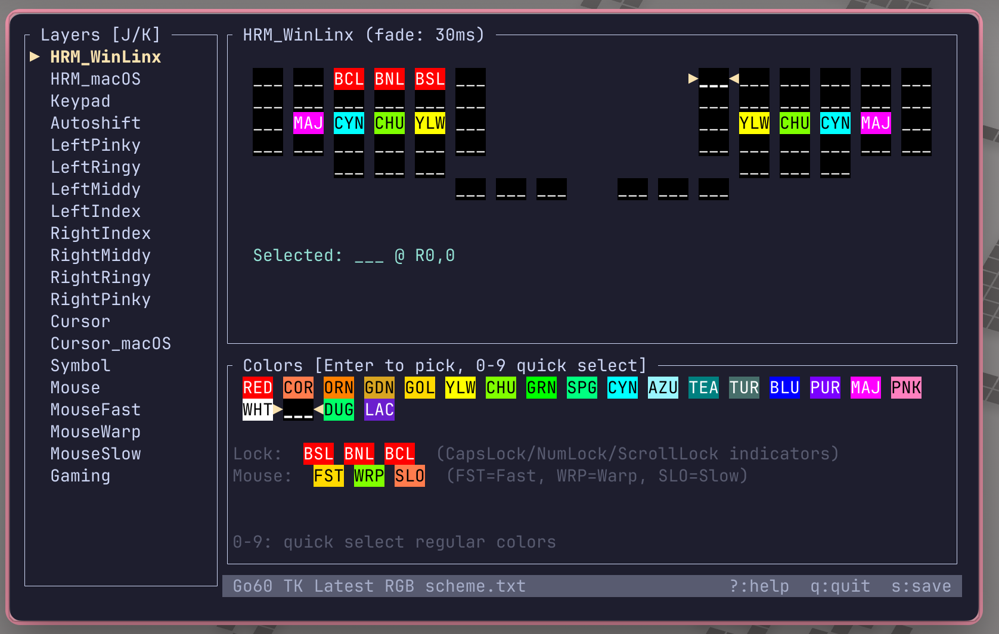

# Go60 RGB Editor

A terminal-based (TUI) RGB underglow editor for ZMK keyboards, specifically designed for the MoErgo Go60 layout.




## Features

- [x] **Visual keyboard layout** - color display matching the physical Go60 layout
- [x] **Layer navigation** - navigate between RGB layers, adjust fade duration
- [x] **Color picker** - select from the full color palette with keyboard navigation
- [x] **Quick color assignment** - number keys for fast color selection
- [x] **Undo/redo** - full edit history support
- [x] **Copy/paste colors** - duplicate color assignments between keys
- [x] **Clear colors** - quickly reset keys to black
- [x] **Clipboard export** - copy configuration to system clipboard
- [x] **Special color support** - lock indicators (CapsLock/NumLock/ScrollLock) and mouse speed aliases
- [x] **Roundtrip parsing** - preserves original file formatting and comments
- [ ] **Layer management** - add, remove, rename layers
- [ ] **Color palette management** - add, edit, remove color definitions

Press `?` in the editor to see all key bindings.

## Supported Keyboards

**Currently supported:**
- MoErgo Go60 layout

**Not supported (alternatives available):**
- Glove80 - see the [TailorKey RGB documentation](https://sites.google.com/view/tailorkey/how-to/rgb) for alternative tools

## Installation

### From source

```bash
git clone https://github.com/silasg/go60-rgb-editor.git
cd go60-rgb-editor
cargo build --release
```

The binary will be at `target/release/go60-rgb-editor`.

## Usage

```bash
go60-rgb-editor <path-to-rgb-config.txt>
```

### Example

```bash
go60-rgb-editor "Go60 TK Latest RGB scheme.txt"
```

## Configuration File Format

The editor works with TailorKey RGB configuration files. For detailed documentation on the file format and RGB configuration options, see:

**[TailorKey RGB Documentation](https://sites.google.com/view/tailorkey/how-to/rgb)**

The included `Go60 TK Latest RGB scheme.txt` is an example configuration from TailorKey.

## Development

Requires Rust 1.70+ and [mise](https://mise.jdx.dev/) for task management.

### Setup

```bash
# Install tools and dependencies
mise install
mise run setup
```

### Available Tasks

```bash
mise tasks ls
```

This will show all available development tasks with descriptions (build, test, coverage, etc.).
